# Multi KPI

> A powerful Multi KPI visualization of a key KPI along with multiple sparklines of supporting data

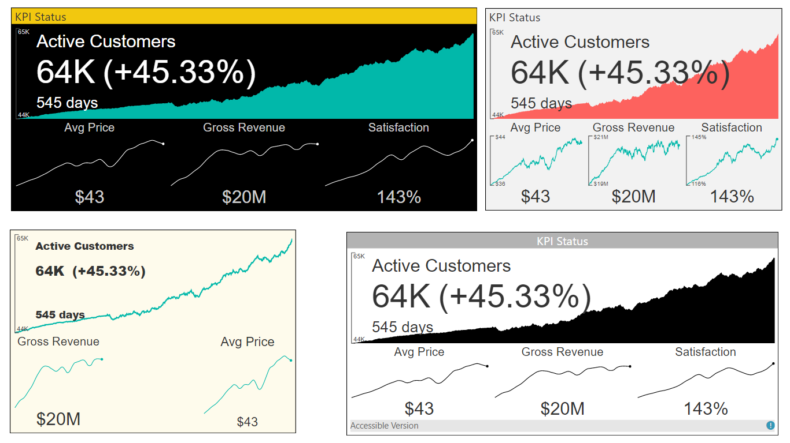
# Overview

The Multi KPI custom visual is good for presenting a key performance indicator (KPI) along with a variety of supporting information, including:
- Title, Subtitle
- Sparklines
- Current date and KPI status (value, date, variance)

Some of the key features include:

- KPI trend over time: hover-over the main chart to see a KPI for each date.
- Rich Formatting Options: set alternate titles, tooltips, font sizes, colors, and background colors.
- Numerous Chart Features: multi KPI supports number types, precision, Y-axis tick marks, and hover-over tooltips.
Sparkline Interpolation: Interpolate sparkline values to get rid of noisy points.
- Auto-Scaling: design a larger tile in your report with rich details. After pinning it to a Power BI Dashboard, you may resize it to smaller versions of the tile without losing essential details.

See also [MultiKPI at Microsoft AppSource](https://appsource.microsoft.com/en-us/product/power-bi-visuals/WA104381763)

# Version 2.2.0 New Functionality
## A new option "Show Latest Available As Current Value" inside "Values" option group

This option is awesome for cases when you have several metrics in a single dates context, and one or several metrics don't have a value for the latest date.

For instance, look at the following table:

| Date       | Metric 1 | Metric 2 | Metric 3 | Metric 4 |
|------------|----------|----------|----------|----------|
| 08/01/2019 | 77200    | 500      | 45       | 22       |
| 08/02/2019 | 77300    | 1000     | 46       | 23       |
| 08/03/2019 | 77400    | 800      | 47       | 25       |
| 08/04/2019 | 77500    | 560      | 48       |          |
| 08/05/2019 | 77600    | 780      | 49       |          |

You can see that one of the metric doesn't contain value for the latest date (08/05/2019).

If this option is disabled the value of Metric 4 will be 0, because another option "Treat Empty/Missing Values As Zero" is enabled by default.

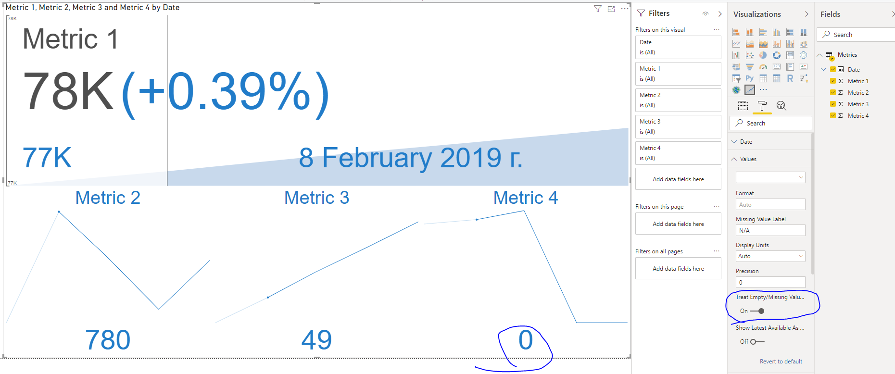

However, if the option "Treat Empty/Missing Values As Zero" was disabled we would see the following picture:

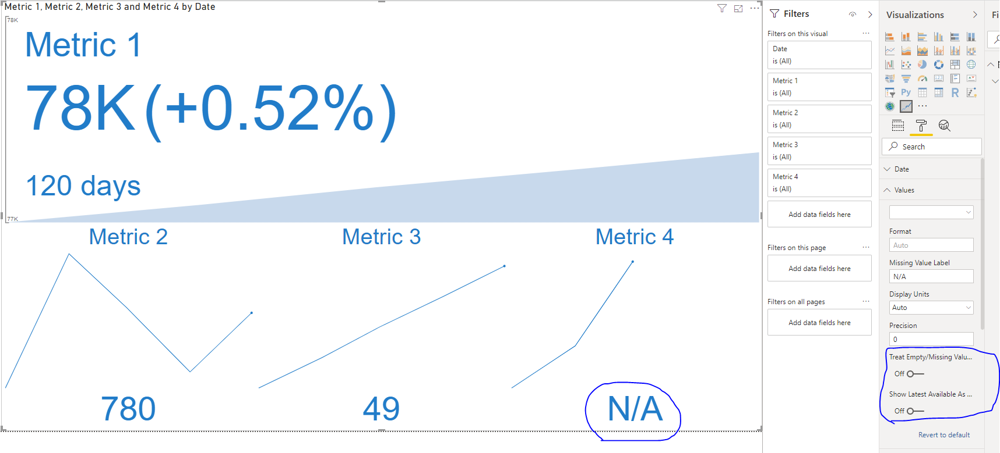

But what if we want to see the latest available value for Metric 4 that is "25"?
Hopefully, it's possible with enabled option "Show Latest Available As Current Value" as on the picture below.

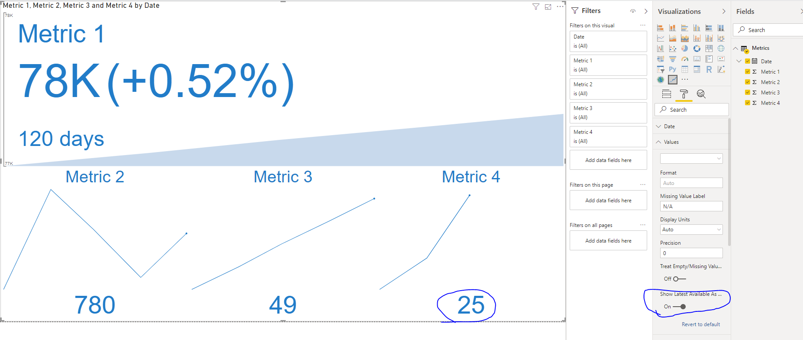

## Stale Data Tooltips now can show information in metric context

Stale Data Tooltips can be seen only if "Stale Data" and "Subtitle" option groups are enabled and data in dataset is stale. Let's consider the same dataset.

| Date       | Metric 1 | Metric 2 | Metric 3 | Metric 4 |
|------------|----------|----------|----------|----------|
| 08/01/2019 | 77200    | 500      | 45       | 22       |
| 08/02/2019 | 77300    | 1000     | 46       | 23       |
| 08/03/2019 | 77400    | 800      | 47       | 25       |
| 08/04/2019 | 77500    | 560      | 48       |          |
| 08/05/2019 | 77600    | 780      | 49       |          |

For instance, if current date is 08/06/2019, mentioned option groups are enabled and other options are by default, we will see a special icon that can show a tooltip, when it is hovered by mouse or tapped as on the picture below.

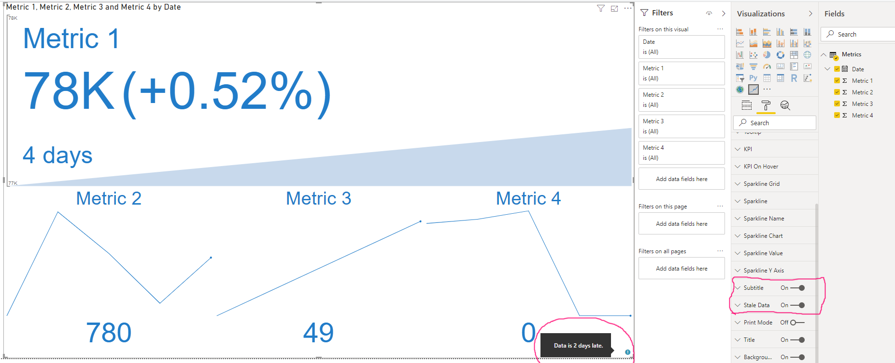

However, if we enable "Show Latest Available As Current Value" and disable "Treat Empty/Missing Values As Zero" option, the tooltip will be shown in metrics context because now the number of days for some of them is different.

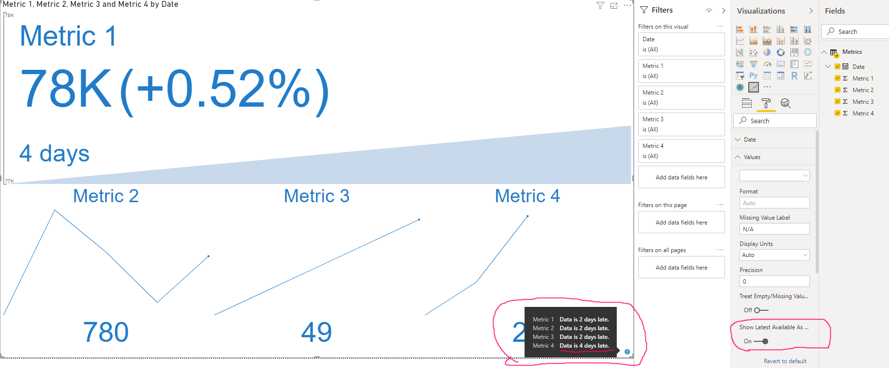

## A new option "Deduct Threshold Days" inside "Stale Data" option group

This option impacts only showing of days inside Stale Data Tooltips.
Let's consider the same dataset again.

| Date       | Metric 1 | Metric 2 | Metric 3 | Metric 4 |
|------------|----------|----------|----------|----------|
| 08/01/2019 | 77200    | 500      | 45       | 22       |
| 08/02/2019 | 77300    | 1000     | 46       | 23       |
| 08/03/2019 | 77400    | 800      | 47       | 25       |
| 08/04/2019 | 77500    | 560      | 48       |          |
| 08/05/2019 | 77600    | 780      | 49       |          |

For instance, if a current date is 08/06/2019, target option is enabled and option "Threshold (days)" in "Stale Data" option group contains "1", the tooltip will show 1 day instead of 2 (you can see it on the previous section) as on the picture below.

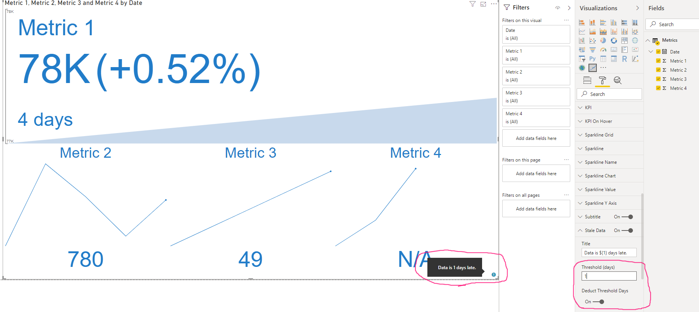

## Main graph shows area under zero correctly now
If a metric contains negative values and Main Chart Type is set as "Area", negative values will be shown as reverse area now. Let's consider the following dataset.

| Date       | Metric 1 | Metric 2 | Metric 3 | Metric 4 |
|------------|----------|----------|----------|----------|
| 08/01/2019 | 77200    | 500      | 45       | 22       |
| 08/02/2019 | 77300    | 1000     | 46       | 23       |
| 08/03/2019 | 77400    | 800      | -47      | 25       |
| 08/04/2019 | 77500    | 560      | -48      |          |
| 08/05/2019 | 77600    | 780      | 49       |          |

You can find that a couple of values for Metric 3 is negative. Previous representation of such case was incorrect and the area considered its base line as the most negative value, as on the picture below.

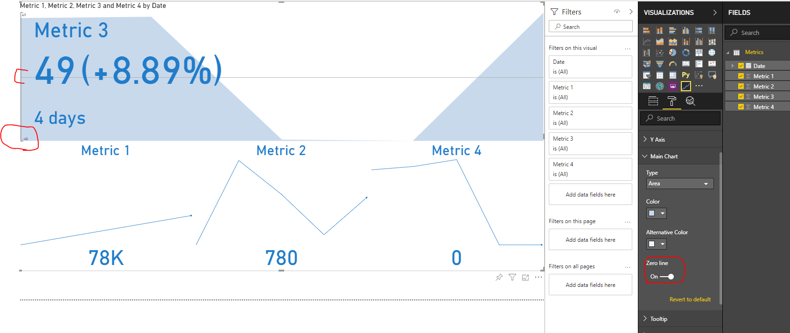

Representation of the case was changed. Now, this case looks as on the following picture.

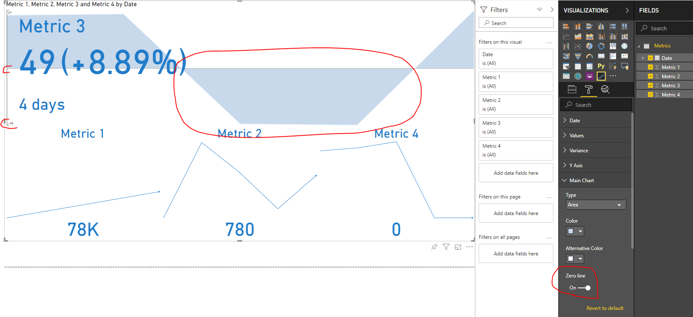

## A new option "Missing Value Label" inside "Values" option group and a new option "Missing Variance Label" inside "Variance" option group

This new option provides an ability to customize label that is shown when a value doesn't exist. Previously it showed "N/A" text, but now this behavior may be changed for both, for all metrics and for a certain metric. Let's consider the following dataset.

| Date       | Metric 1 | Metric 2 | Metric 3 | Metric 4 |
|------------|----------|----------|----------|----------|
| 08/01/2019 | 77200    | 500      | 45       | 22       |
| 08/02/2019 | 77300    | 1000     | 46       | 23       |
| 08/03/2019 | 77400    | 800      | -47      | 25       |
| 08/04/2019 | 77500    | 560      | -48      |          |
| 08/05/2019 | 77600    | 780      | 49       |          |

Metric 4 doesn't have value for the latest date so, if we switch off options "Treat Empty/Missing Values As Zero" and "Show Latest Available As Current Value", we will see "N/A" label for the value and for variance too as on the following picture.

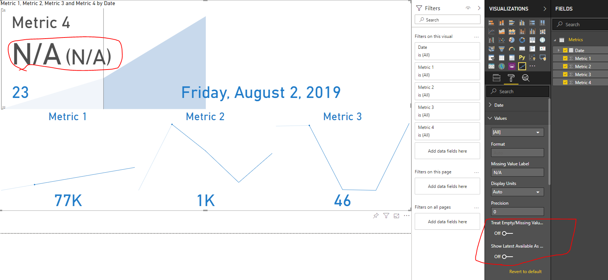

However, if you want to customize these labels you can set up a label text in an appropriate option as on the pictures below.

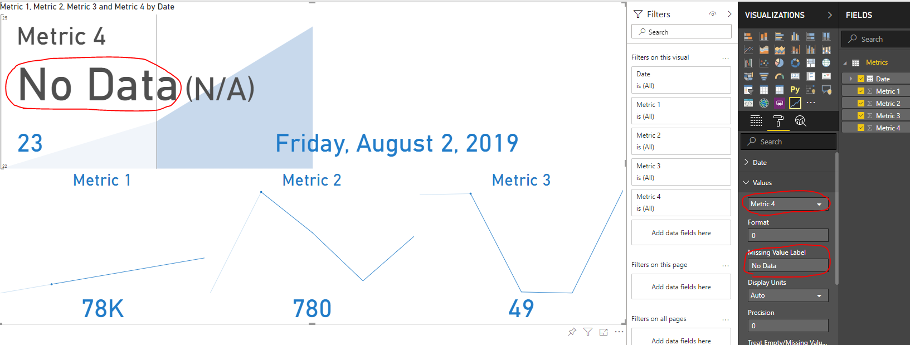

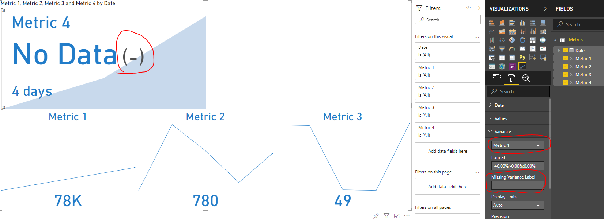

## Renaming of several labels
Renamed lables:
- "Treat Empty Values As Zero" --> "Treat Empty/Missing Values As Zero"
- "Variance N/A Color" --> "Missing Variance Color"
- "Variance N/A Font Size" --> "Missing Variance Font Size"
